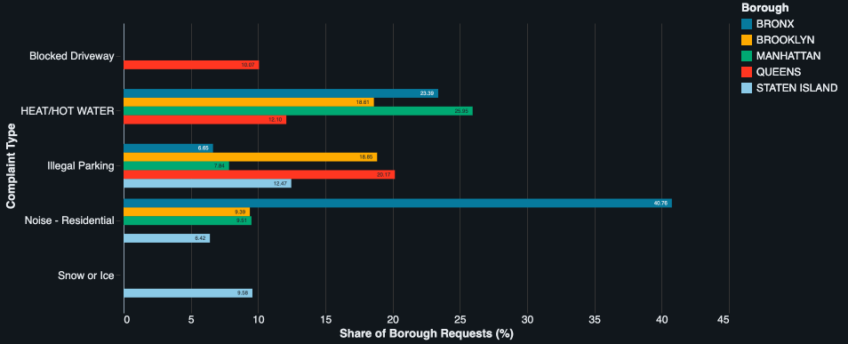
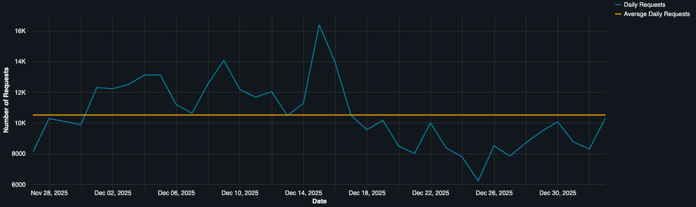
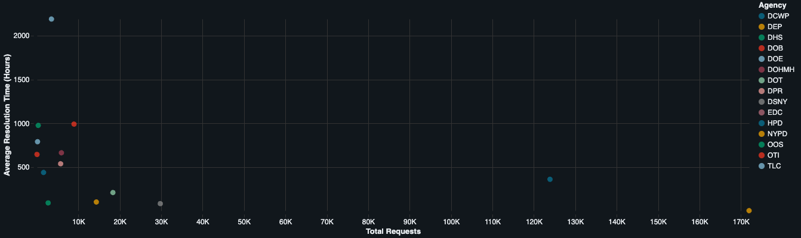

# NYC 311 Data Engineering Pipeline

An end-to-end data engineering portfolio project that uses PySpark, Parquet, Spark SQL, and Databricks to ingest, validate, clean, transform, analyze, and visualize NYC 311 service request data.

The project demonstrates practical data engineering concepts including Spark DataFrames, data-quality validation, analytical transformations, columnar storage, SQL analytics, window functions, and cloud-based Spark workflows.

## Table of Contents

- [Project Overview](#project-overview)
- [Pipeline Architecture](#pipeline-architecture)
- [Project Status](#project-status)
- [Data Quality Findings](#data-quality-findings)
- [PySpark Ingestion](#pyspark-ingestion)
- [PySpark Inspection](#pyspark-inspection)
- [PySpark Cleaning](#pyspark-cleaning)
- [PySpark Transformation](#pyspark-transformation)
- [Transformation Outputs](#transformation-outputs)
- [Why Parquet?](#why-parquet)
- [SQL Analysis](#sql-analysis)
- [Databricks](#databricks)
- [Key Findings](#key-findings)
- [Project Structure](#project-structure)
- [Technologies](#technologies)
- [Requirements](#requirements)
- [Data Source](#data-source)
- [Project Goal](#project-goal)

## Project Overview

This project builds an end-to-end data engineering pipeline using NYC 311 service request data.

The workflow begins with raw CSV data from NYC Open Data and processes it locally using PySpark. A dedicated inspection stage identifies data-quality issues before cleaning rules are applied.

The cleaned data is stored in Parquet format and transformed into an analysis-ready request-level dataset with additional date, time, and resolution metrics.

Spark SQL is then used to analyze complaint patterns, borough differences, agency workload, request timing, daily activity, and resolution behavior.

The final transformed Parquet dataset is also loaded into Databricks, where the analytical workflow is reproduced using Spark DataFrames, SQL, and native Databricks visualizations.

### Dataset Scope

- **Source:** NYC Open Data
- **Dataset:** 311 Service Requests from 2020 to Present
- **Date range:** November 27, 2025 12:00 AM through January 2, 2026 11:44:59 PM
- **Rows:** 389,087
- **Raw columns:** 44
- **Coverage:** All five NYC boroughs, with source records containing `Unspecified` borough values preserved

The dataset intentionally covers the Thanksgiving through New Year holiday period.

A historical date range was selected so the project could analyze a fixed and reproducible snapshot rather than continuously changing current data.

## Pipeline Architecture

```text
NYC Open Data
      ↓
Raw CSV
      ↓
PySpark Ingestion
      ↓
Schema & Column Validation
      ↓
PySpark Data Quality Inspection
      ↓
PySpark Cleaning
      ↓
Cleaned Parquet
      ↓
PySpark Transformation
      ↓
Transformed Parquet
      ↓
Summary Datasets
      ↓
Spark SQL Analysis
      ↓
Databricks
      ↓
Visual Analysis
```

PySpark is the primary processing engine throughout the pipeline, with Databricks providing the final cloud-based Spark and visualization environment.

## Project Status

### Completed

- NYC Open Data acquisition
- Local PySpark environment configuration
- Raw CSV ingestion
- File and expected-column validation
- Spark schema inspection
- Row and column validation
- Date-range validation
- Missing-value analysis
- Missing-value placeholder detection
- Full-row duplicate detection
- Unique Key duplicate validation
- Status quality analysis
- Closed Date consistency analysis
- Invalid date-order detection
- Borough and geographic data inspection
- ZIP-code completeness analysis
- Coordinate completeness analysis
- Complaint type consistency analysis
- Agency consistency analysis
- PySpark cleaning pipeline
- Datetime conversion to Spark timestamp types
- Missing-value placeholder normalization
- Complaint type capitalization standardization
- Invalid date-order flagging
- Post-cleaning validation
- Cleaned Parquet output
- PySpark transformation pipeline
- Request date feature creation
- Resolution-time calculation
- Transformation validation
- Transformed Parquet output
- Complaint summary dataset
- Borough summary dataset
- Agency summary dataset
- Date summary dataset
- Spark SQL analysis layer
- CTE-based analytical queries
- Window functions and ranking analysis
- Borough complaint pattern analysis
- Agency workload and resolution-speed analysis
- Hourly request-volume analysis
- Day-of-week request analysis
- Daily request spike analysis
- Complaint-level peak-hour analysis
- Borough-level complaint resolution comparison
- Local SQL execution through PySpark
- Databricks data loading
- Databricks Spark DataFrame validation
- Databricks SQL analysis
- Databricks visualizations
- Databricks notebook export
- Databricks HTML export
- Git-tracked project structure and documentation

## Data Quality Findings

The inspection stage identifies data-quality issues before cleaning logic is applied.

This separation ensures that cleaning decisions are based on observed properties of the dataset rather than assumptions.

### Missing Values

Missing data is not automatically removed.

Many NYC 311 fields are optional or only apply to specific types of service requests. Missing values are therefore preserved unless there is a reliable reason to modify them.

The inspection stage also found that NYC 311 uses the literal value:

```text
N/A
```

as a missing-data placeholder in several string columns.

These values are normalized to Spark `NULL` values during cleaning.

### Closed Date

There are **5,647 requests with a missing `Closed Date`**.

Most belong to unresolved requests with statuses such as:

- Open
- In Progress
- Pending
- Assigned
- Started

One request marked `Closed` also has a missing `Closed Date`.

Rather than fabricating a timestamp, the pipeline preserves the missing value.

The inspection stage also identified non-Closed requests that contain a `Closed Date`. Because the source data can contain these combinations, resolution time is not calculated solely based on the presence of a `Closed Date`.

### Invalid Date Ordering

Inspection identified **42 records where `Created Date` occurs after `Closed Date`**.

Of these:

- 40 are Pending requests
- 2 are Closed requests

All 42 records also have `Closed Date` equal to `Resolution Action Updated Date`.

The original timestamps are preserved.

Instead of modifying source data without evidence, the cleaning pipeline adds:

```text
Invalid Date Order
```

as a boolean column.

These records remain in the dataset but are prevented from receiving invalid negative resolution-time values during transformation.

### Complaint Type Consistency

The inspection identified inconsistent capitalization for two complaint categories:

```text
ELEVATOR
Elevator

PLUMBING
Plumbing
```

The cleaning pipeline standardizes them as:

```text
ELEVATOR → Elevator
PLUMBING → Plumbing
```

### Geographic Data

Some records contain:

- missing ZIP codes
- missing latitude and longitude
- `Unspecified` borough values

These values are preserved when reliable replacement information is unavailable.

The pipeline does not fabricate geographic information.

Records with an `Unspecified` borough remain in the processed and transformed datasets but are excluded from SQL analyses intended specifically to compare the five NYC boroughs.

### Duplicate Validation

The dataset contains:

```text
Full-row duplicates: 0
Duplicate Unique Keys: 0
```

No duplicate-removal step is necessary.

### Agency Validation

Agency inspection found:

```text
Missing or blank agencies: 0
Agency code/name inconsistencies: 0
```

No agency cleaning is required.

## PySpark Ingestion

`src/ingest.py` is responsible for loading and validating the raw NYC 311 dataset.

The ingestion stage:

- verifies that the raw CSV exists
- loads the dataset into a Spark DataFrame
- reads the CSV header
- infers the initial Spark schema
- preserves identifier-like fields such as ZIP codes as strings
- validates required columns
- returns a reusable Spark DataFrame

Important expected fields include:

- `Unique Key`
- `Created Date`
- `Closed Date`
- `Agency`
- `Problem (formerly Complaint Type)`
- `Status`
- `Borough`

The ingestion stage validates:

```text
389,087 rows
44 raw columns
```

## PySpark Inspection

`src/inspection.py` performs data-quality analysis before cleaning decisions are applied.

Inspections include:

- row count
- column count
- Spark schema
- earliest and latest request dates
- null counts
- null percentages
- core-field completeness
- missing-value placeholder detection
- full-row duplicates
- duplicate Unique Keys
- status distributions
- missing Closed Dates by status
- Closed requests with missing Closed Dates
- non-Closed requests containing Closed Dates
- invalid date ordering
- borough distributions
- missing ZIP codes
- unspecified borough records
- missing geographic coordinates
- coordinate mismatches
- complaint type distributions
- complaint type consistency
- agency distributions
- agency name consistency

The inspection layer is intentionally separate from the cleaning layer.

```text
Inspect
   ↓
Identify Problems
   ↓
Define Cleaning Rules
   ↓
Clean
   ↓
Validate
```

This prevents the pipeline from modifying data blindly.

## PySpark Cleaning

`src/clean.py` applies the cleaning decisions identified during inspection.

### Datetime Conversion

The following fields are converted from raw strings into Spark timestamp types:

- `Created Date`
- `Closed Date`
- `Resolution Action Updated Date`

### Missing-Value Normalization

Literal `N/A` placeholders are converted to Spark `NULL` values in known affected columns.

The cleaning pipeline handles placeholders found in:

- `Problem Detail (formerly Descriptor)`
- `Additional Details`
- `Facility Type`
- `Resolution Description`
- `Park Facility Name`
- `Location Type`
- `Road Ramp`
- `Bridge Highway Segment`

Post-cleaning validation confirms that no known `N/A` placeholders remain.

### Invalid Date Ordering

The cleaning pipeline preserves records where:

```text
Created Date > Closed Date
```

and adds:

```text
Invalid Date Order
```

as a boolean flag.

The source timestamps themselves are not altered.

### Complaint Type Standardization

The following complaint categories are standardized:

```text
ELEVATOR → Elevator
PLUMBING → Plumbing
```

### Post-Cleaning Validation

Before the processed dataset is written, the cleaning pipeline verifies that:

- `Invalid Date Order` flags correctly match the underlying date-order condition
- known `N/A` placeholders have been removed
- unstandardized `ELEVATOR` and `PLUMBING` values no longer remain

The invalid-date validation checks the cleaning rule itself rather than depending on a hardcoded number of invalid records.

If these expectations fail, the pipeline raises an error rather than silently producing incorrect processed data.

### Cleaned Dataset

The cleaned output contains:

```text
Rows: 389,087
Columns: 45
Duplicate Unique Keys: 0
Remaining known N/A placeholders: 0
Invalid Date Order records: 42
```

The cleaned dataset is written to:

```text
data/processed/nyc_311_cleaned.parquet
```

## PySpark Transformation

`src/transform.py` converts the cleaned request-level dataset into analysis-ready data.

### Request Date Features

The transformation pipeline adds:

- `request_date`
- `request_year`
- `request_month`
- `request_day_of_week`
- `request_hour`

These fields allow downstream analysis by date, month, weekday, and hour.

### Resolution Time

The pipeline adds:

```text
resolution_time_hours
```

Resolution time is calculated only when:

- `Status` is `Closed`
- `Closed Date` is present
- `Invalid Date Order` is `False`

This prevents unresolved, non-Closed, or invalid-date records from producing misleading resolution-time values.

### Transformation Validation

Before transformed data is written, the pipeline verifies that:

- all expected transformation columns exist
- the transformed row count matches the cleaned row count
- invalid date-order records do not have resolution times
- unresolved records do not have resolution times
- non-Closed records do not have resolution times
- no negative resolution times exist

The transformed request-level dataset contains:

```text
Rows: 389,087
Columns: 51
Invalid rows with resolution time: 0
Non-Closed rows with resolution time: 0
Negative resolution times: 0
```

## Transformation Outputs

The transformation stage produces one request-level transformed dataset and four summary datasets.

### Transformed Request-Level Dataset

```text
data/transformed/nyc_311_transformed.parquet
```

This dataset contains the original cleaned fields plus derived analytical columns.

### Complaint Summary

```text
data/transformed/complaints_summary.parquet
```

Contains:

- complaint type
- request count
- average resolution time in hours

### Borough Summary

```text
data/transformed/borough_summary.parquet
```

Contains:

- borough
- request count
- average resolution time in hours

### Agency Summary

```text
data/transformed/agency_summary.parquet
```

Contains:

- agency
- request count
- average resolution time in hours

### Date Summary

```text
data/transformed/date_summary.parquet
```

Contains:

- request date
- request count

These datasets provide reusable analytical outputs without requiring every downstream task to rebuild the same aggregations.

## Why Parquet?

The processed and transformed layers use Parquet for analytical processing.

Unlike CSV, Parquet is a columnar storage format designed for analytical workloads.

Benefits include:

- columnar storage
- smaller file sizes
- preserved data types
- efficient column-based reads
- compression
- strong PySpark compatibility
- strong Databricks compatibility
- efficient downstream SQL analytics

The raw dataset remains CSV because that is how the source data is obtained from NYC Open Data.

Spark writes Parquet datasets as directories containing multiple partition files.

Example:

```text
nyc_311_cleaned.parquet/
├── _SUCCESS
├── part-00000-....snappy.parquet
├── part-00001-....snappy.parquet
├── part-00002-....snappy.parquet
└── ...
```

Spark reads the directory as one logical dataset.

## SQL Analysis

The transformed request-level Parquet dataset is analyzed using Spark SQL.

The SQL analysis is stored in:

```text
sql/analysis.sql
```

and executed locally through:

```text
src/run_sql.py
```

`run_sql.py` creates a temporary Spark SQL view over the transformed Parquet dataset, reads the SQL analysis file, executes each query, and prints labeled results for review.

### Analytical Queries

The SQL layer contains nine analytical queries.

#### 1. Top Complaint Types Within Each Borough

Ranks the top three complaint types within each NYC borough and calculates each complaint type's percentage share of total borough requests.

#### 2. High-Volume and Slow-Resolution Complaint Types

Identifies complaint categories with above-average request volume and compares:

- total request count
- resolved request count
- average resolution time

#### 3. Agency Workload vs Resolution Speed

Ranks agencies by request workload and compares workload with average resolution time.

Agencies without valid resolution-time metrics remain visible rather than being removed from the analysis.

#### 4. Borough Resolution Coverage and Speed

Compares the five NYC boroughs using:

- total requests
- resolved requests
- average resolution time
- resolution coverage percentage

#### 5. Peak Hours for 311 Activity

Analyzes request volume across all 24 hours of the day.

The query:

- counts requests by hour
- ranks hours by activity
- calculates each hour's percentage share of total requests

#### 6. Day-of-Week Request Patterns

Calculates average request volume per calendar day for each weekday.

The analysis also:

- distinguishes weekdays from weekends
- compares average resolution times
- ranks weekdays by average daily request volume

#### 7. Daily Spike vs Daily Average

Compares each analyzed date with the overall average daily request count.

Each date is classified as:

- Above Average
- Below Average
- Average

The query also calculates the percentage difference from the overall daily average.

#### 8. Peak Hour by Complaint Type

Identifies the highest-volume request hours for the ten most common complaint categories.

Window functions are used to rank hourly activity independently within each complaint type.

#### 9. Complaint Resolution Differences Across Boroughs

Compares average resolution times for high-volume complaint types across NYC boroughs.

A minimum resolved-request threshold is applied to prevent rankings from being driven by extremely small samples.

### SQL Concepts Demonstrated

The SQL analysis uses:

- filtering
- grouping
- aggregations
- conditional aggregation
- CTEs
- joins
- cross joins
- subqueries
- window functions
- `RANK`
- `DENSE_RANK`
- `HAVING`
- percentage calculations
- date-based analysis
- time-based analysis

Records with an `Unspecified` borough remain preserved in the transformed dataset but are excluded from analyses intended specifically to compare the five NYC boroughs.

## Databricks

The final analytical stage transfers the transformed NYC 311 dataset into Databricks.

The transformed Parquet data is loaded from a Databricks Volume using PySpark:

```python
parquet_path = "/Volumes/workspace/default/nyc_311_data/"
df = spark.read.parquet(parquet_path)
```

The Databricks notebook validates the imported dataset, inspects its Spark schema and analytical columns, and creates a temporary SQL view:

```python
df.createOrReplaceTempView("nyc_311")
```

The SQL analysis is then executed within the Databricks environment using SQL cells.

This demonstrates that the same transformed Parquet data and Spark-oriented analytical workflow can move from a local environment into Databricks without redesigning the underlying pipeline.

### Databricks Outputs

The repository contains both the notebook export and a rendered HTML export:

```text
databricks/nyc_311_analysis.ipynb
databricks/nyc_311_analysis.html
```

The notebook contains the PySpark and SQL workflow.

The HTML export preserves the executed Databricks results and native visualizations for review outside the Databricks workspace.

### Databricks Visualizations

Six visualizations were created from the SQL analysis:

- Top Complaint Types by Borough Share
- Agency Workload vs Resolution Speed
- Borough Resolution Coverage vs Average Resolution Time
- Request Volume by Hour of Day
- Average Request Volume by Day of Week
- Daily Request Volume vs Average

All six exported charts are stored in:

```text
charts/
```

Three representative visualizations are highlighted below.

### Top Complaint Types by Borough Share

This chart highlights how complaint composition differs across NYC boroughs.



### Daily Request Volume vs Average

This visualization compares daily 311 request volume with the overall daily average across the holiday-period dataset.



### Agency Workload vs Resolution Speed

This scatter plot compares agency request volume with average resolution time, demonstrating that workload and resolution behavior vary substantially across agencies.



The remaining visualizations are also available in the `charts/` directory:

```text
charts/
├── agency_workload_vs_resolution_speed.png
├── average_request_volume_by_day_of_week.png
├── borough_resolution_coverage_vs_average_resolution_time.png
├── daily_request_volume_vs_average.png
├── request_volume_by_hour_of_day.png
└── top_complaint_types_by_borough_share.png
```

## Key Findings

The SQL and Databricks analysis produced several notable patterns within the selected holiday-period dataset.

### Complaint Patterns Differ Strongly by Borough

The most common complaint types vary substantially across boroughs.

- **Bronx:** Residential Noise represents approximately **40.76%** of borough requests and is the dominant complaint category.
- **Brooklyn:** Illegal Parking and HEAT/HOT WATER are the two largest complaint categories.
- **Manhattan:** HEAT/HOT WATER is the largest complaint category.
- **Queens:** Illegal Parking is the most common complaint category.
- **Staten Island:** Illegal Parking is the most common complaint category, with Snow or Ice also representing a notable share.

These differences demonstrate why borough-level aggregation is more informative than relying only on citywide totals.

### Request Activity Peaks During the Morning

Across all requests, the highest-volume hour is approximately **10:00 AM**, with about **23,395 requests** occurring during that hour across the dataset.

The surrounding morning hours also show high activity, indicating that 311 request volume rises sharply after the early-morning period.

### Daily Volume Changes Throughout the Holiday Period

The average daily request volume is approximately **10,516 requests**.

Notable days include:

- **December 15, 2025:** approximately **16,388 requests**, about **55.84% above** the daily average
- **December 25, 2025:** approximately **6,216 requests**, about **40.89% below** the daily average
- **November 27, 2025:** approximately **8,147 requests**, about **22.53% below** the daily average

The holiday period therefore contains substantial day-to-day variation rather than a uniform request pattern.

### Weekdays Generally Produce More Requests Than Weekends

Monday has the highest average daily request volume among the analyzed weekdays, followed by Tuesday and Friday.

Saturday and Sunday show lower average request volumes than most weekdays.

### Resolution Behavior Varies Across Agencies and Complaint Types

Average resolution times differ substantially across agencies and complaint categories.

For example, high-volume NYPD request categories can have relatively short average resolution times, while some housing-related complaint categories remain open much longer.

These comparisons are descriptive rather than direct measures of agency performance because NYC agencies handle fundamentally different types of service requests and operational responsibilities.

### Borough Resolution Coverage Is High

Across the five boroughs, the large majority of eligible requests have valid resolution information.

Resolution coverage is approximately:

- Bronx: **99.51%**
- Brooklyn: **98.44%**
- Queens: **98.25%**
- Staten Island: **98.21%**
- Manhattan: **96.85%**

Resolution-time comparisons should still be interpreted in the context of complaint type and agency responsibility rather than as simple performance rankings.

## Project Structure

```text
nyc-311-data-pipeline/
├── charts/
│   ├── agency_workload_vs_resolution_speed.png
│   ├── average_request_volume_by_day_of_week.png
│   ├── borough_resolution_coverage_vs_average_resolution_time.png
│   ├── daily_request_volume_vs_average.png
│   ├── request_volume_by_hour_of_day.png
│   └── top_complaint_types_by_borough_share.png
├── data/
│   ├── raw/
│   │   └── .gitkeep
│   ├── processed/
│   │   └── .gitkeep
│   └── transformed/
│       └── .gitkeep
├── databricks/
│   ├── nyc_311_analysis.html
│   └── nyc_311_analysis.ipynb
├── sql/
│   └── analysis.sql
├── src/
│   ├── ingest.py
│   ├── inspection.py
│   ├── clean.py
│   ├── transform.py
│   └── run_sql.py
├── .gitignore
├── README.md
└── requirements.txt
```

The actual datasets are excluded from GitHub because of their size.

The `.gitkeep` files preserve the intended data directory structure while keeping generated datasets out of version control.

Generated inspection and SQL output text files are also excluded from version control.

Locally, the pipeline produces:

```text
data/
├── raw/
│   └── nyc_311_raw.csv
├── processed/
│   └── nyc_311_cleaned.parquet/
└── transformed/
    ├── nyc_311_transformed.parquet/
    ├── complaints_summary.parquet/
    ├── borough_summary.parquet/
    ├── agency_summary.parquet/
    └── date_summary.parquet/
```

## Technologies

- Python
- Apache Spark
- PySpark
- Spark SQL
- Parquet
- Databricks
- Git
- GitHub

## Requirements

Python dependencies are listed in:

```text
requirements.txt
```

Install them with:

```bash
pip install -r requirements.txt
```

The project also requires a compatible Java installation because Apache Spark runs on the JVM.

## Data Source

**NYC Open Data**  
**311 Service Requests from 2020 to Present**

The raw dataset is downloaded from NYC Open Data and stored locally as:

```text
data/raw/nyc_311_raw.csv
```

The raw dataset itself is not stored in this repository because of its size.

## Project Goal

The goal of this project is to demonstrate a practical Spark-oriented data engineering workflow using real public data.

The project follows the data lifecycle:

```text
Raw Data
   ↓
Ingestion
   ↓
Validation
   ↓
Inspection
   ↓
Cleaning
   ↓
Processed Parquet
   ↓
Transformation
   ↓
Transformed Parquet & Summaries
   ↓
Spark SQL Analysis
   ↓
Databricks
   ↓
Visualization & Findings
```

The project emphasizes both implementation and data engineering decision-making.

Each stage is designed to answer a specific question:

- Is the expected source data present?
- Does the schema contain the fields the pipeline depends on?
- What data-quality problems exist?
- Which issues should actually be corrected?
- Which missing values should be preserved?
- How should suspicious source records be handled without fabricating information?
- How should valid analytical metrics such as resolution time be defined?
- How can transformed data be structured efficiently for downstream analytics?
- How can SQL be used to identify meaningful patterns in transformed data?
- How can the same Spark workflow be transferred from a local environment to Databricks?
- How can analytical results be communicated through clear visualizations?

The final result demonstrates an end-to-end data engineering workflow built around PySpark, Parquet, Spark SQL, Databricks, and reproducible analytical decision-making.
